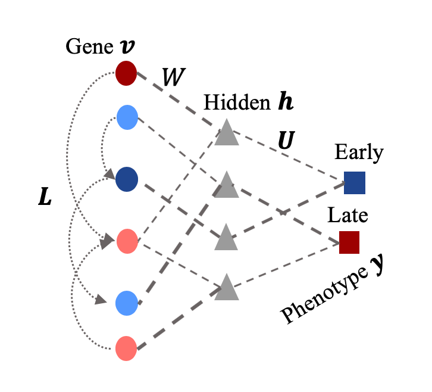

# ECMarker

A biologically and clinically interpretable machine learning model to reveal gene expression biomarkers for classifying early cancer and predicting clinical outcomes.

## Introduction
ECMarker is an interpretable and scalable machine learning model to predict gene expression biomarkers for disease phenotypes and simultaneously reveal underlying regulatory mechanisms. It is built on the integration of semi- [1]and discriminative- restricted [2]Boltzmann machines, a neural network model for classification allowing lateral connections at the input gene layer. This interpretable model is scalable without needing any prior feature selection and enables directly modeling and prioritizing genes and revealing potential gene networks (from lateral connections) for the phenotypes. This model allows one to directly model and prioritize gene interactions for the classification of clinical phenotypes, revealing potential gene regulatory networks (GRNs) for different disease stages. The framework of ECMarker is depicted in the figure below: 
<p align="center">
  
</p>

## Installation

This script need no installation, but has the following requirements:
* PyTorch 0.4.1 or above
* Python 3.6.5 or above
* Captum


## Usage

### Input data formats

* gene expression data matrix (genes by patients): a csv file with n rows and m columns. n is the number of paitents and m is the number of genes. 

* disease stage data: an csv file includes the cancer stages of patients. 

### Load example data
The example data is downloaded from the publicly accessible dataset[2] which is including gene expression data and clinical information of non-small cell lung cancer (NSCLC) patients. We grouped patients based on their tumor/node/metastasis (TMN) stages, with (I+IA+IB) as the early stage  and II, III, and IV as the late stage, then divided the dataset into training and testing datasets. The detail of data processing is intrucuded in https://www.biorxiv.org/content/10.1101/825414v1.full. 

```python
import pandas as pd
import numpy as np

Train = pd.read_csv('Data/Train.csv')
TrainLabel = pd.read_csv('Data/TrainLabel.csv')
Test = pd.read_csv('Data/Test.csv')
TestLabel = pd.read_csv('Data/TestLabel.csv')

X_train = Train.values
y_train = TrainLabel.values
X_test = Test.values
y_test = TestLabel.values
```
In the Label file, 0 indicates early stage patients, 1 indicates late stage paitents. 

### Run ECMarker
#### Step 1: Define ECMarker model
```python
import torch
from torch.utils.data import Dataset, TensorDataset, DataLoader
import torch.autograd as autograd
from model import GRBM
from utils import *
device = 'cuda' if torch.cuda.is_available() else 'cpu' # training with cuda if available

batch_size = 50 # batch size
n_epochs = 1 # number of epochs
lr = 0.01 # learning rate
L1REG = 0.1
L2REG = 0.9
moment = None
n_hid = 9 # number of neurons in the hidden layer
n_target = 2
n_vis = X.shape[1] # input size
opt = torch.optim.SGD

model = GRBM(n_vis=n_vis, n_target=n_target, n_hid=n_hid, k=5).to(device)
```

#### Step 2: Train the ECMarker with training set, then test on the testing set. 
```python
X_train, y_train, X_test, y_test = map(
    torch.tensor, (X_train, y_train, X_test, y_test)
)
train_ds = TensorDataset(X_train, y_train)
test_ds = TensorDataset(X_test, y_test)

train_dl = DataLoader(dataset=train_ds, 
                          sampler = ImbalancedDatasetSampler(train_ds), 
                          batch_size=batch_size)
test_dl = DataLoader(dataset=test_ds, 
                        batch_size=batch_size*2)

model = train(model, train_dl, opt=opt, n_epochs=n_epochs, lr=lr, 
              L1REG=L1REG, L2REG=L2REG, moment=moment, device=device)

from sklearn.metrics import accuracy_score
with torch.no_grad():
    X_test, y_test = next(iter(test_dl))
    model.eval()
    y_hat = model(X_test)
    y_hat_class = np.where(y_hat.cpu().numpy()<0.5, 0, 1)
    test_accuracy = accuracy_score(y_test, y_hat_class)
```

#### Step 3: Extract biomarkers and gene network from the well-trained ECMarker
```python
# Gene Network
gene_network = model.L

# Biomarkers
from captum.attr import IntegratedGradients

feature_names = Test.index.tolist()
ig = IntegratedGradients(model.cpu())
device = 'cpu'

# Biomarkers for early stage (set target=0)
attr, delta = ig.attribute(X_test.cpu(), target=0, return_convergence_delta=True)
early_biomarkers = dict(zip(feature_names, np.mean(attr.detach().numpy(), axis=0)))

# Biomarkers for late stage (set target=1)
attr, delta = ig.attribute(X_test.cpu(), target=1, return_convergence_delta=True)
late_biomarkers = dict(zip(feature_names, np.mean(attr.detach().numpy(), axis=0)))
```


## Reference
[1] Osindero, S. & G. Hinton. 2007a. Modeling image patches with a directed hierarchy of Markov random fields.\
[2] Gentles, A. J., S. V. Bratman, L. J. Lee, J. P. Harris, W. Feng, R. V. Nair, D. B. Shultz, V. S. Nair, C. D. Hoang, R. B. West, S. K. Plevritis, A. A. Alizadeh & M. Diehn (2015) Integrating Tumor and Stromal Gene Expression Signatures With Clinical Indices for Survival Stratification of Early-Stage Non–Small Cell Lung Cancer. JNCI: Journal of the National Cancer Institute, 107.
